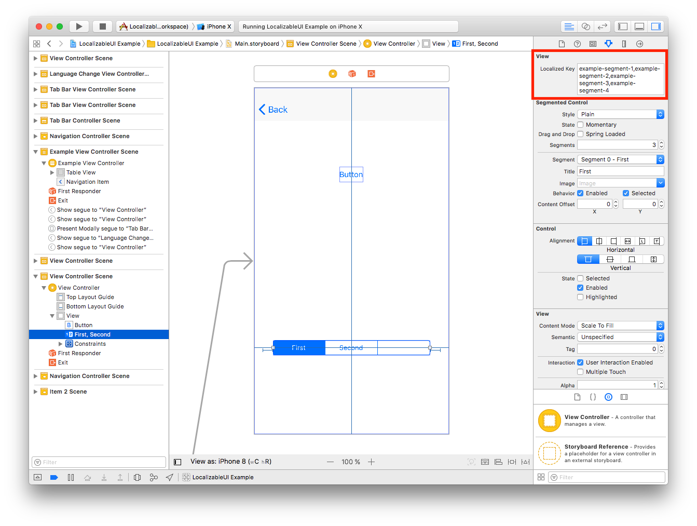
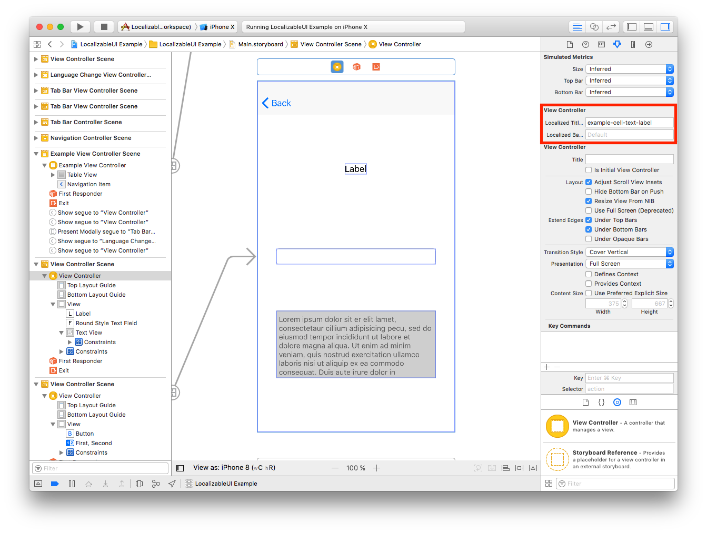
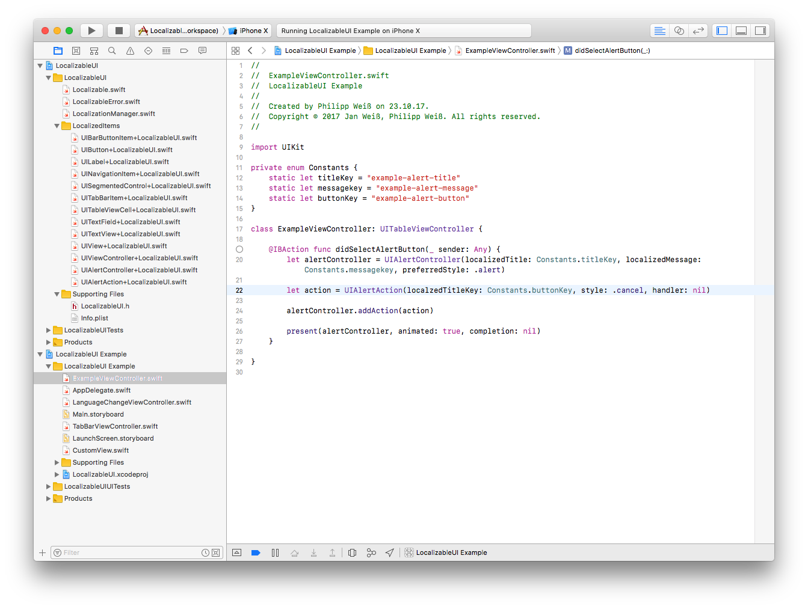

# LocalizableUI

[](https://travis-ci.org/weiss19ja/LocalizableUI)
[](https://codecov.io/gh/weiss19ja/LocalizableUI)
[](http://cocoapods.org/pods/LocalizableUI)
[](http://cocoapods.org/pods/LocalizableUI)
[](http://cocoapods.org/pods/LocalizableUI)

## Example

To run the example project, clone the repo, and run `pod install` from the Example directory first.

###Supported UIElements

* UIBarButtonItem
* UIButton
* UILabel
* UINavigationItem
* UISegmentedControl
* UITabBarItem
* UITableViewCell
* UITextField
* UITextView
* UIView
* UIViewController
* UIAlertController
* UIAlertAction

## Requirements

* iOS 9.0+
* Xcode 9.0+
* Swift 4.0+

## Communication

* If you find any useful element missing please open an issue.
* If you found a bug, open an issue.
* If you want to contribute, submit a pull request.

## Installation

### CocoaPods
LocalizableUI is available through [CocoaPods](http://cocoapods.org). To install
it, simply add the following line to your Podfile:

```ruby
pod 'LocalizableUI'
```

### Carthage
Add `github "weiss19ja/LocalizableUI"`to your Cartfile.

### Swift Package Manager
```swift
dependencies: [
    .package(url: "https://github.com/weiss19ja/LocalizableUI.git", from: "0.2.0")
]
```
## Usage
The easiest way to use LocalizableUI is the Storyboard. Here you can enter your Localizable.strings Keys.


For the SegmentedControl you can enter an array of Localizable.strings Keys separated by ",".


The BackButton can be set in the prior ViewController. Here you can use the ViewController fields in the Storyboard.


If you are using an NavigationItem this will override the Title and the BackButton of the ViewController.


AlertViews must be configured in the code.


It is also possible to set the LocalizableKeys in the Code.


## Authors

Jan Weiß, Philipp Weiß

## License

LocalizableUI is available under the MIT license. See the LICENSE file for more info.
 